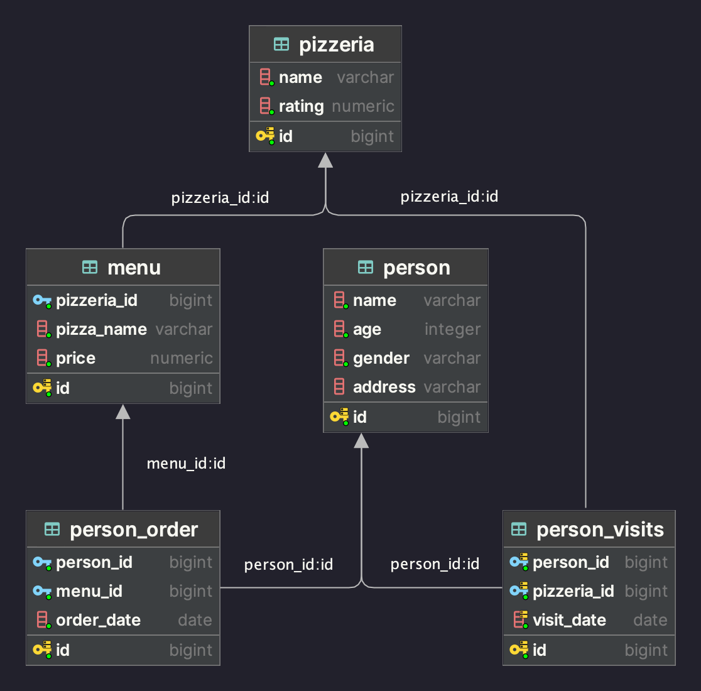

## Day_01 - Множества и соединения

1. [**Exercise 00**](src/ex00/day01_ex00.sql): Использование UNION для объединения данных из разных таблиц с переименованием столбцов;
2. [**Exercise 01**](src/ex01/day01_ex01.sql): Применение UNION ALL для объединения результатов без удаления дубликатов;
3. [**Exercise 02**](src/ex02/day01_ex02.sql): Использование UNION для выбора уникальных значений и их сортировка в обратном алфавитном порядке;
4. [**Exercise 03**](src/ex03/day01_ex03.sql): Использование INTERSECT ALL для нахождения общих элементов с сохранением дубликатов;
5. [**Exercise 04**](src/ex04/day01_ex04.sql): Применение EXCEPT ALL для нахождения разницы множеств с учетом дубликатов;
6. [**Exercise 05**](src/ex05/day01_ex05.sql): Использование CROSS JOIN для создания декартова произведения двух таблиц;
7. [**Exercise 06**](src/ex06/day01_ex06.sql): Применение подзапроса с INTERSECT ALL и последующее соединение результата с другой таблицей через INNER JOIN;
8. [**Exercise 07**](src/ex07/day01_ex07.sql): Использование INNER JOIN и функции CONCAT для объединения данных из разных таблиц;
9. [**Exercise 08**](src/ex08/day01_ex08.sql): Демонстрация использования NATURAL JOIN в сочетании с подзапросом для объединения таблиц;
10. [**Exercise 09**](src/ex09/day01_ex09.sql): Сравнение двух методов поиска отсутствующих значений: с использованием NOT IN и NOT EXISTS в подзапросах.

Для тестов необходимо запустить скрипт [model.sql](src/model.sql) с моделью базы данных.

