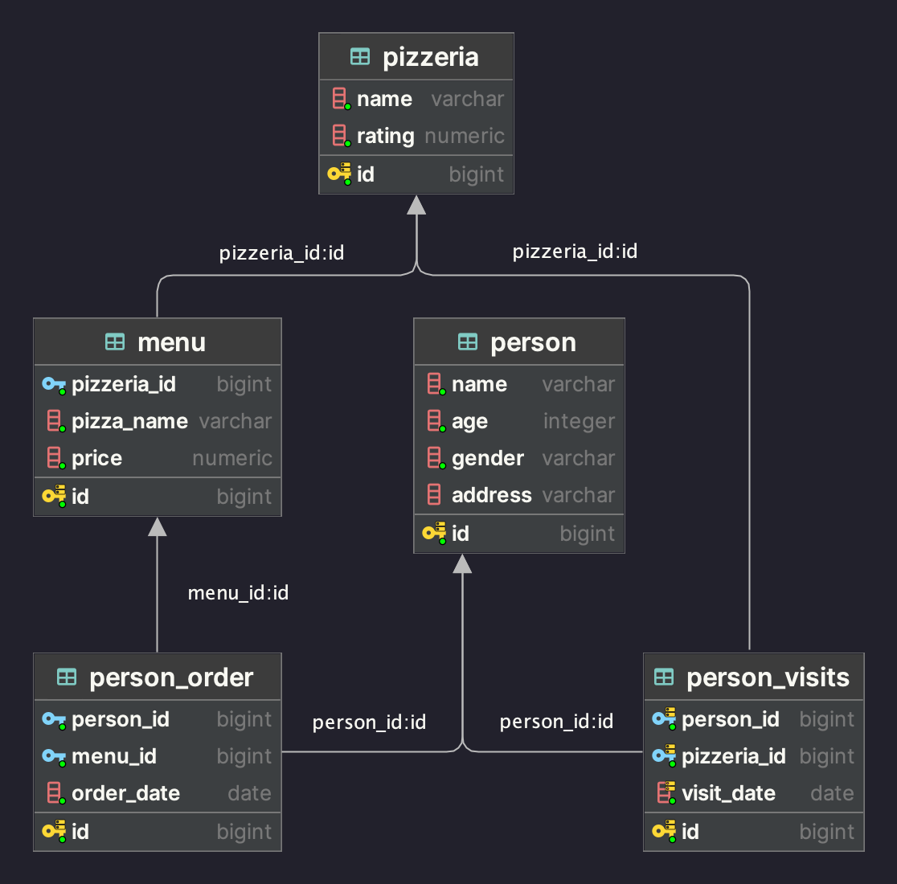

## Day_02 - Углубленное изучение соединений

1. [**Exercise 00**](src/ex00/day02_ex00.sql): Использование LEFT JOIN для нахождения пиццерий без посещений;
2. [**Exercise 01**](src/ex01/day02_ex01.sql): Применение generate_series для создания последовательности дат и LEFT JOIN для выявления пропущенных дат визитов;
3. [**Exercise 02**](src/ex02/day02_ex02.sql): Использование FULL JOIN для объединения данных из трех таблиц с применением COALESCE для обработки NULL значений;
4. [**Exercise 03**](src/ex03/day02_ex03.sql): Создание CTE (WITH clause) для генерации последовательности дат и использование LEFT JOIN для поиска пропущенных дат визитов;
5. [**Exercise 04**](src/ex04/day02_ex04.sql): Использование INNER JOIN для соединения таблиц и фильтрация результатов с помощью оператора IN;
6. [**Exercise 05**](src/ex05/day02_ex05.sql): Применение базовой фильтрации с использованием WHERE и сортировка результатов;
7. [**Exercise 06**](src/ex06/day02_ex06.sql): Использование множественных INNER JOIN для связывания нескольких таблиц и фильтрация с помощью оператора IN;
8. [**Exercise 07**](src/ex07/day02_ex07.sql): Применение нескольких INNER JOIN с комбинированными условиями фильтрации для поиска конкретной информации;
9. [**Exercise 08**](src/ex08/day02_ex08.sql): Использование INNER JOIN и множественных условий фильтрации для выбора данных по нескольким критериям;
10. [**Exercise 09**](src/ex09/day02_ex09.sql): Применение INTERSECT для нахождения общих элементов двух запросов, каждый из которых использует множественные INNER JOIN;
11. [**Exercise 10**](src/ex10/day02_ex10.sql): Использование self-join (соединение таблицы с самой собой) для нахождения пар людей с одинаковым адресом, с исключением дубликатов и самосравнений.

Для тестов необходимо запустить скрипт [model.sql](src/model.sql) с моделью базы данных.

