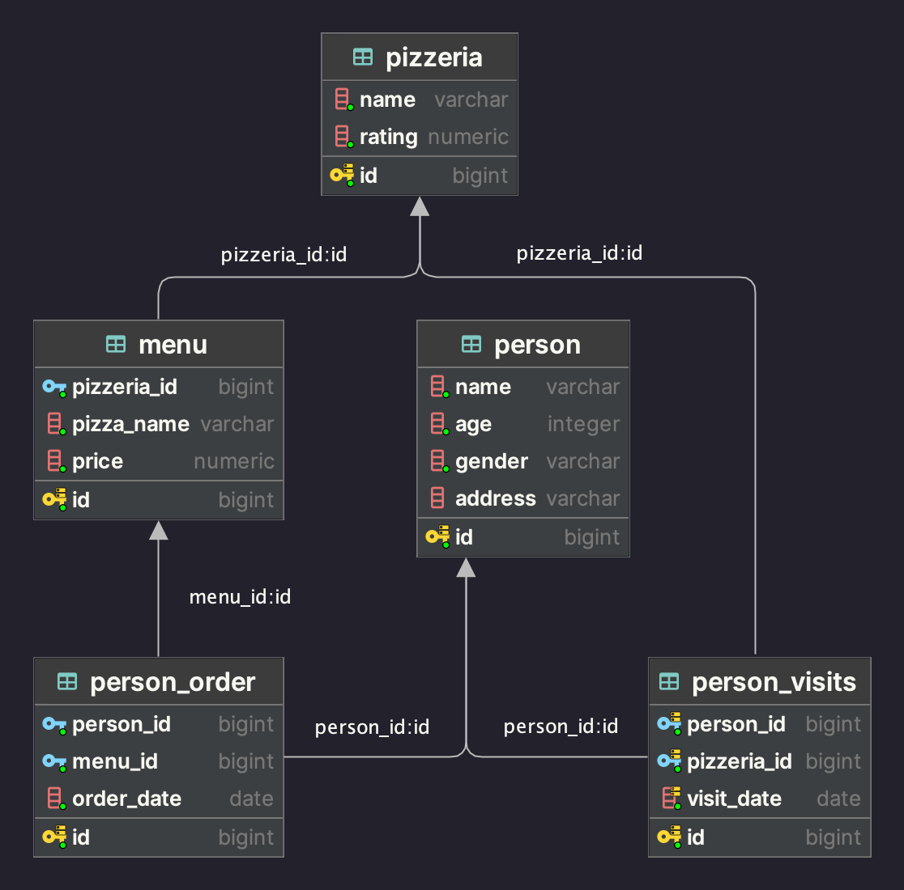

# Day_04 - Представления и материализованные представления

1. [**Exercise 00**](src/ex00/day04_ex00.sql): Создание представлений (VIEW) для фильтрации данных по полу;
2. [**Exercise 01**](src/ex01/day04_ex01.sql): Использование UNION ALL для объединения данных из двух представлений;
3. [**Exercise 02**](src/ex02/day04_ex02.sql): Создание представления с использованием функции generate_series для генерации дат;
4. [**Exercise 03**](src/ex03/day04_ex03.sql): Применение оператора EXCEPT для нахождения дат без посещений;
5. [**Exercise 04**](src/ex04/day04_ex04.sql): Создание представления, реализующего симметрическую разность множеств с использованием EXCEPT и UNION;
6. [**Exercise 05**](src/ex05/day04_ex05.sql): Создание представления для расчета цен со скидкой, используя JOIN для объединения таблиц;
7. [**Exercise 06**](src/ex06/day04_ex06.sql): Создание материализованного представления (MATERIALIZED VIEW) для хранения результатов сложного запроса;
8. [**Exercise 07**](src/ex07/day04_ex07.sql): Вставка новых данных и обновление материализованного представления с помощью REFRESH MATERIALIZED VIEW;
9. [**Exercise 08**](src/ex08/day04_ex08.sql): Удаление созданных представлений и материализованных представлений с использованием DROP VIEW и DROP MATERIALIZED VIEW.

Для тестов необходимо запустить скрипт [model.sql](src/model.sql) с моделью базы данных.

